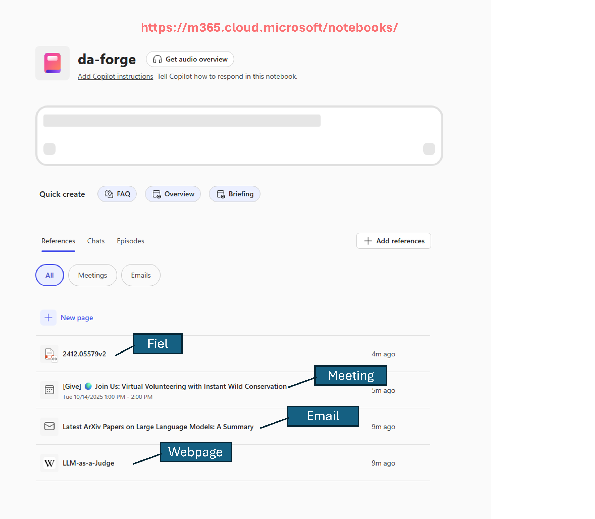
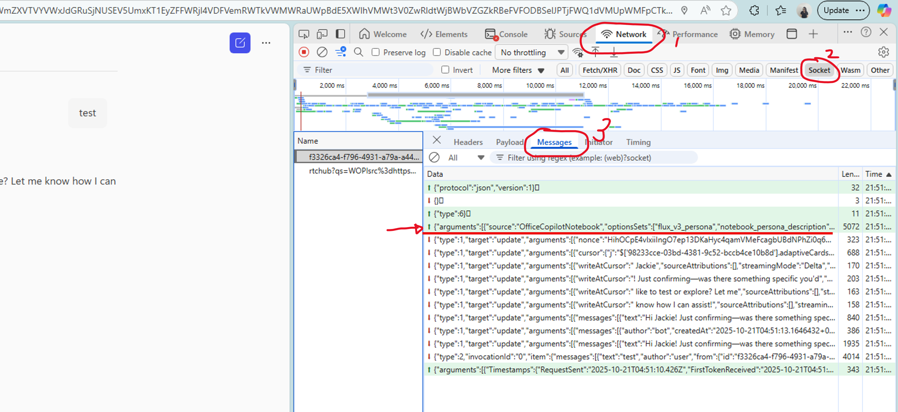

# Socket Files & Capabilities Guide

This guide explains how to extract socket JSON from Copilot Notebooks and create socket files for DA-Forge.

---

## What are Socket Files?

Socket files are JSON arrays that contain capability configurations extracted from Copilot Notebooks. Each capability defines what grounding context (emails, meetings, files, webpages) your Declarative Agent can access.

**File location:** `sockets/your-agent-name.json`

---

## Extracting Socket JSON from Copilot Notebook

### Step-by-Step Guide

1. **Open [Copilot Notebook](https://m365.cloud.microsoft/notebooks/)** in Microsoft 365 
   - Navigate to your Copilot Notebook
   - Add grounding references (files, emails, meetings, webpages)
  
2. **Open Browser DevTools**
   - Press `F12` or right-click → **Inspect**
   - Go to the **Network** tab
   - Find the **Socket** tab under **Network**

3. **Trigger the API**
   - Send any message, e.g. 'test'
   - Watch the `Messages` tab for API calls
   

4. **Find the API Payload**
   - Look for requests arguments like `arguments`
   - Click on the request
   - Go to **Payload** or **Request** tab
    

5. **Locate the Capabilities Array**
   - Find a JSON array containing objects with `capabilities` fields
   - Example structure:
   ```json
   [
     {
       "name": "OneDriveAndSharePoint",
       "items_by_sharepoint_ids": [...]
     },
     {
       "name": "Email",
       "x-items_by_id": [...]
     }
   ]
   ```

6. **Copy and Save**
   - Copy the entire capabilities array
   - Save to: `sockets/my-agent.json`
   - Verify it's valid JSON

---

## Socket File Format

A socket file is a **JSON array** containing capability objects:

```json
[
  {
    "name": "CapabilityName",
    "field1": "value1",
    "field2": [...]
  },
  {
    "name": "AnotherCapability"
  }
]
```

---

## Supported Capabilities

### 1. OneDriveAndSharePoint

Ground your agent on specific files and folders from OneDrive or SharePoint.

**Structure:**
```json
{
  "name": "OneDriveAndSharePoint",
  "x-disable_file_prefetch": true,
  "items_by_sharepoint_ids": [
    {
      "site_id": "12345678-1234-1234-1234-123456789abc",
      "web_id": "87654321-4321-4321-4321-cba987654321",
      "list_id": "abcdef12-3456-7890-abcd-ef1234567890",
      "unique_id": "11111111-2222-3333-4444-555555555555",
      "type": "File"
    }
  ]
}
```

**How to get IDs:**
1. Upload/select file in Copilot Notebook
2. Extract from network request payload
3. Look for `items_by_sharepoint_ids` array

**Notes:**
- `type` can be `"File"` or `"Folder"`
- DA-Forge automatically removes the `type` field and adds defaults during manifest generation
- `x-disable_file_prefetch` controls file loading behavior

---

### 2. Email

Ground on specific email messages or threads.

**Structure:**
```json
{
  "name": "Email",
  "x-items_by_id": [
    {
      "message_id": "AAkALgAAAAAAHYQDEapmEc2byACqAC-EWg0AH...",
      "conversation_id": "AAQkAGU5ZjI4NzQ2LTk2YzYtNDU4Yy1hMDEx...",
      "subject": "Project Kickoff Discussion"
    }
  ]
}
```

**How to get IDs:**
1. Select emails in Copilot Notebook
2. Extract from network payload
3. Look for `x-items_by_id` with `message_id` and `conversation_id`

**Notes:**
- Each email requires both `message_id` and `conversation_id`
- `subject` is optional but helpful for documentation

---

### 3. Meetings

Ground on meeting transcripts, notes, and recordings.

**Structure:**
```json
{
  "name": "Meetings",
  "x-items_by_id": [
    {
      "id": "AAMkAGU5ZjI4NzQ2LTk2YzYtNDU4Yy1hMDEx...",
      "subject": "Weekly Standup",
      "is_series": false
    }
  ]
}
```

**How to get IDs:**
1. Select meetings in Copilot Notebook
2. Extract from network payload
3. Look for `x-items_by_id` with meeting `id`

**Notes:**
- `is_series`: `true` for recurring meetings, `false` for single meetings
- `subject` is optional but helpful for documentation

---

### 4. WebSearch

Enable web search capability (experimental).

**Structure:**
```json
{
  "name": "WebSearch",
  "sites": [
    {
      "url": "https://example.com",
      "x-is_leaf_page": true,
      "x-title": "Example Page"
    }
  ],
  "x-enable_scoped_search_agent": true
}
```

**How to configure:**
1. Enable web search in Copilot Notebook
2. Optionally add specific sites to scope
3. Extract from network payload

**Notes:**
- `x-enable_scoped_search_agent`: Enable scoped search
- `sites`: Optional array of specific sites to search
- This is an **experimental capability** (goes into `x-experimental_capabilities`)

---

### 5. Pages

Ground on Loop pages or OneNote pages.

**Structure:**
```json
{
  "name": "Pages"
}
```

**How to enable:**
1. Add Loop or OneNote pages in Copilot Notebook
2. Extract from network payload
3. May include additional fields for specific pages

**Notes:**
- This is an **experimental capability**
- Often used without additional configuration

---

### 6. CodeInterpreter

Enable code execution capability.

**Structure:**
```json
{
  "name": "CodeInterpreter"
}
```

**How to enable:**
1. Enable code interpreter in Copilot Notebook
2. Extract from network payload

**Notes:**
- No additional configuration needed
- Allows agent to execute Python code for data analysis

---

## Complete Example

Here's a full socket file with multiple capabilities:

```json
[
  {
    "name": "OneDriveAndSharePoint",
    "x-disable_file_prefetch": true,
    "items_by_sharepoint_ids": [
      {
        "site_id": "12345678-1234-1234-1234-123456789abc",
        "web_id": "87654321-4321-4321-4321-cba987654321",
        "list_id": "abcdef12-3456-7890-abcd-ef1234567890",
        "unique_id": "11111111-2222-3333-4444-555555555555",
        "type": "File"
      }
    ]
  },
  {
    "name": "Email",
    "x-items_by_id": [
      {
        "message_id": "AAkALgAAAAAAHYQDEapmEc2byACqAC-EWg0AH...",
        "conversation_id": "AAQkAGU5ZjI4NzQ2LTk2YzYtNDU4Yy1hMDEx...",
        "subject": "Project Discussion"
      }
    ]
  },
  {
    "name": "Meetings",
    "x-items_by_id": [
      {
        "id": "AAMkAGU5ZjI4NzQ2LTk2YzYtNDU4Yy1hMDEx...",
        "subject": "Team Standup",
        "is_series": false
      }
    ]
  },
  {
    "name": "WebSearch",
    "sites": [
      {
        "url": "https://en.wikipedia.org/wiki/LLM-as-a-Judge",
        "x-is_leaf_page": true,
        "x-title": "LLM-as-a-Judge"
      }
    ],
    "x-enable_scoped_search_agent": true
  },
  {
    "name": "CodeInterpreter"
  },
  {
    "name": "Pages"
  }
]
```

**Save this to:** `sockets/my-notebook-agent.json`

**Deploy with:**
```bash
da-forge deploy my-notebook-agent
```

---

## Capability Categorization

DA-Forge automatically categorizes capabilities during manifest generation:

### Regular Capabilities
- `OneDriveAndSharePoint`
- `Email`
- `Meetings`
- `CodeInterpreter`

### Experimental Capabilities
- `WebSearch`
- `Pages`

**This categorization is handled automatically - you don't need to worry about it.**

---

## Tips & Best Practices

### 1. Start Simple
Begin with one or two capabilities, verify deployment works, then add more.

### 2. Use Examples as Templates
Copy `examples/full-capabilities.json` and replace placeholder IDs with your actual IDs.

### 3. Validate JSON
Ensure your socket file is valid JSON before deploying:
```bash
python -m json.tool sockets/my-agent.json
```

### 4. Keep IDs Organized
Add `"subject"` or `"x-title"` fields to document what each item is.

### 5. Network Tab Filtering
In DevTools Network tab, filter by "Fetch/XHR" to reduce noise.

---

## Troubleshooting

### Socket file not found
**Error:** `✗ Socket file not found: sockets/my-agent.json`

**Solution:**
- Verify file exists in `sockets/` folder
- Check filename matches what you're deploying
- Ensure file has `.json` extension

### Invalid JSON
**Error:** JSON parsing errors during deployment

**Solution:**
- Validate JSON syntax: `python -m json.tool sockets/my-agent.json`
- Check for missing commas, brackets, quotes
- Copy examples and modify incrementally

### Missing IDs
**Error:** Agent deploys but doesn't access grounding content

**Solution:**
- Verify all required ID fields are present
- Re-extract socket JSON from Copilot Notebook
- Check IDs haven't been truncated during copy/paste
---

## Need Help?

- **Examples:** See `examples/` folder for template socket files
- **Issues:** [GitHub Issues](https://github.com/yourusername/da-forge/issues)
- **Main README:** [README.md](../README.md)
